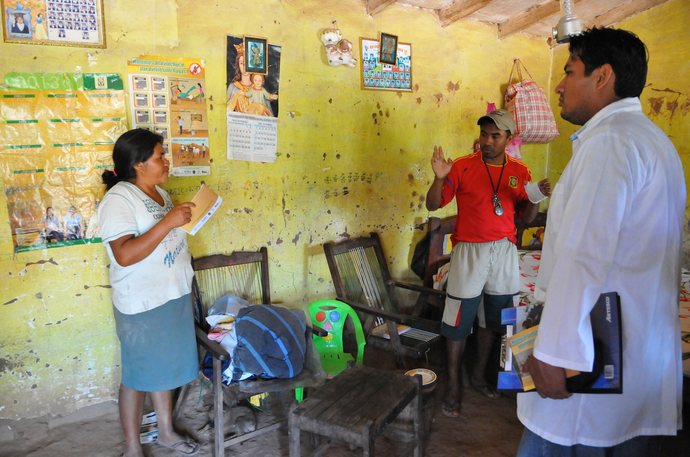

# 📋 Analisis predictivo sobre el estado de salud en Mexico y el mundo

### 🙆 Proyecto realizado por:
- Patricio A. Villanueva Gio
- Dafne Tamayo Leon
- Maria Paula Perez Romo

### 🔎 Objetivos
Este proyecto busca implementar modelos de predicción avanzados para poder predecir el estado de salud de un sector (`vulnerable` o `no vulnerable`) especifico con el fin de poder determinar que sectores de la población se encuentran en riesgo. El proyecto busca generar una pagina web de noticias del mundo para determinar como estos factores afectan la salud y la felicidad de las personas.

### ✒️ Metodologia
El proyecto consta de la siguiente estructura
``` bash
|--Salud del mundo
|
|----data
|   |--BancoMundial.csv # Informacion del banco mundial respecto a los indicadores de salud
|   |--Metadata_Country_API_8_DS2_es_csv_v2_32576.csv # Informacion extraida del banco mundial sobre los macro sectores economicos de mexico 
|   |--Metadata_Indicator_API_8_DS2_es_csv_v2_32576.csv # Lista de indicadores de salud
|
|----graphs
|   |--indicadores.png # Imagen con los indicadores graficados
|   |--indicadores_economia.png # Indicadores respecto al estatus economico
|
|----reportes
|   |--report.ipynb # Reporte escrito del proyecto de investigación 
|
|----resources
|   |-- .pdf # Archivo sobre
|   |-- .pdf # Archivo sobre
|   |-- .pdf # Archivo sobre
|   |-- .pdf # Archivo sobre
|   |-- .pdf # Archivo sobre
|   |-- .pdf # Archivo sobre
|   |-- .pdf # Archivo sobre
|   |-- .pdf # Archivo sobre
|   |-- .pdf # Archivo sobre
|   |-- .pdf # Archivo sobre
|
|----static
|   |--style.css # Diseños css
|   |--error.css # Diseños css
|   |--risk.css # Diseños css
|   |--sugestion.css # Diseños css
|   |--logo.png # Logo del equipo
|   |--bancoMundial.png # Logo del banco mundial 
|   |--datos.txt # Derechos de uso de los datos
|
|----templates
|   |--index.html # Home page
|   |--sugestions.html # FAQ
|   |--riskgroups.html # Grupos de riesgo de salud
|   |--graphs_predictions.html # Predicciones (Home page -> graphs_predictions)
|   |--error.html # Pagina para capturar errores
|
|----app.py # Servidor de python
|
|----README.md # README / Presentación del proyecto
```

### 🌍 Impacto
El impacto de este proyecto radica en su capacidad para identificar sectores vulnerables en términos de salud, lo cual es crucial para la formulación de políticas públicas y programas de intervención social. Al predecir qué grupos de la población son más propensos a estar en riesgo, se pueden tomar acciones preventivas que mejoren la calidad de vida y reduzcan las desigualdades en el acceso a la atención sanitaria. Además, el desarrollo de una página web de noticias vinculada a indicadores de salud ayudará a mantener informada a la población sobre cómo los eventos globales pueden influir en su bienestar.

### ⚖️ Importancia
Con el aumento de las disparidades en salud y el impacto de los determinantes sociales y económicos en el bienestar, es esencial contar con herramientas predictivas que permitan detectar y priorizar acciones hacia los sectores más necesitados. Este proyecto pretende ser una herramienta tanto para el público como para los gobiernos y organizaciones que buscan información relevante para tomar decisiones informadas. La importancia de este trabajo también radica en el hecho de que relaciona la información económica y social con el estado de salud, permitiendo un análisis integral y sistémico de la situación.

### 📊 Fuente de datos: Banco Mundial
Los datos utilizados en este proyecto provienen del Banco Mundial, una institución internacional que proporciona datos confiables y de alta calidad sobre distintos aspectos de desarrollo, incluyendo indicadores de salud y economía. El Banco Mundial es reconocido mundialmente por sus metodologías de recopilación de datos rigurosas y por la transparencia en la presentación de sus estadísticas. La fiabilidad de esta fuente se debe a que los datos son recopilados en colaboración con gobiernos nacionales, organizaciones internacionales y expertos del sector, asegurando tanto su precisión como su relevancia para el análisis de políticas y estrategias de desarrollo.

### 👥 Beneficiarios Potenciales y Aplicación Práctica
Los beneficiarios potenciales de este proyecto incluyen:

1. __Gobiernos y Entidades Públicas__: Los modelos predictivos pueden ayudar a los gobiernos a identificar los sectores más vulnerables y desarrollar políticas públicas que mejoren el acceso a servicios de salud y la calidad de vida de esas comunidades. Además, las predicciones sobre factores de riesgo permitirían a las instituciones de salud planificar sus recursos y estrategias de intervención con mayor precisión.

2. __Organizaciones no Gubernamentales (ONGs)__: ONGs dedicadas a la salud y el bienestar social podrían usar estos datos para enfocar mejor sus campañas y asignar recursos de forma más eficiente, asegurándose de llegar a aquellos sectores de la población con mayor necesidad.

3. __Profesionales de la Salud__: Los médicos, especialistas y otros profesionales de la salud podrían emplear las predicciones para identificar áreas y factores que influyen negativamente en la salud de la población, lo cual facilitaría la implementación de programas preventivos y de concienciación.

4. __Investigadores y Académicos__: Este análisis ofrece una base sólida para realizar investigaciones adicionales sobre la correlación entre variables económicas y el estado de salud. Además, la herramienta desarrollada puede ser usada como un punto de partida para estudios más complejos.

5. __Público en General__: La página web de noticias del proyecto informará al público sobre los factores económicos, sociales y ambientales que impactan su salud, ayudándolos a tomar decisiones más informadas para mejorar su bienestar personal.

### ⚠️ Retos y Limitaciones
__Calidad de los Datos__: Aunque el Banco Mundial es una fuente confiable, los datos siempre pueden tener limitaciones como errores de reporte, falta de cobertura en ciertas áreas o el desfase temporal en la actualización de los indicadores.

__Generalización del Modelo__: Los modelos predictivos pueden verse limitados en su capacidad para generalizar los resultados a otros países o regiones que no cuentan con datos similares o cuyos determinantes de salud sean diferentes.

__Factores Externos No Controlables__: Hay factores imprevistos, como pandemias, desastres naturales, o cambios políticos, que afectan la salud de la población y que no pueden ser fácilmente predichos o considerados por los modelos.

---

---
# Desarrollo del proyecto

__Obtención de los datos__

