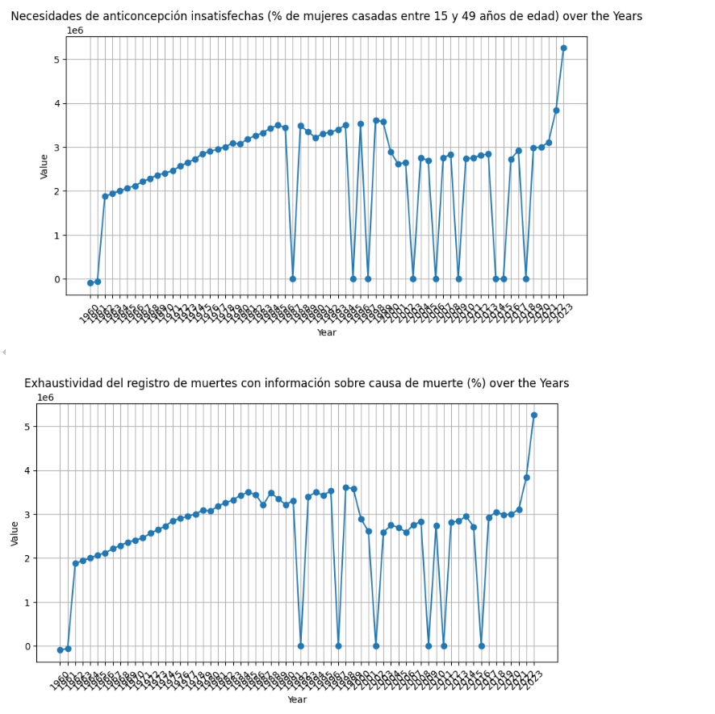
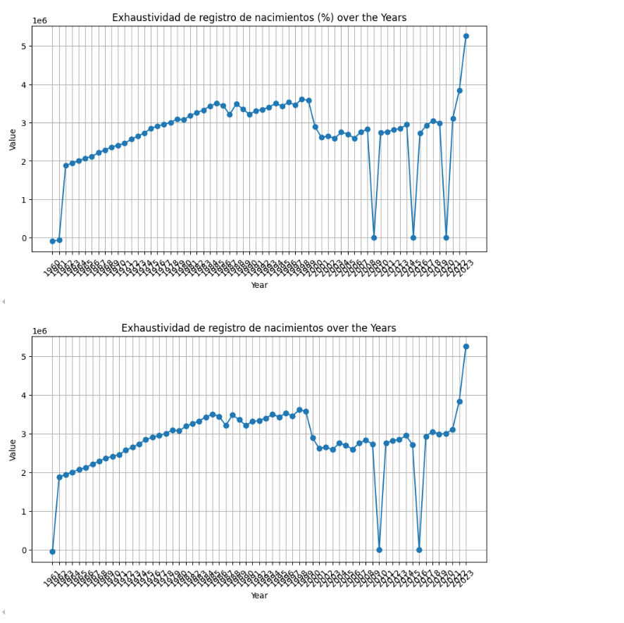
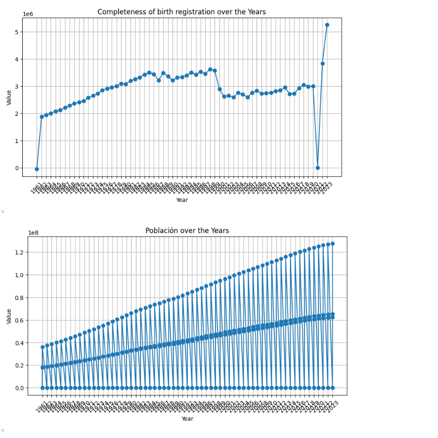
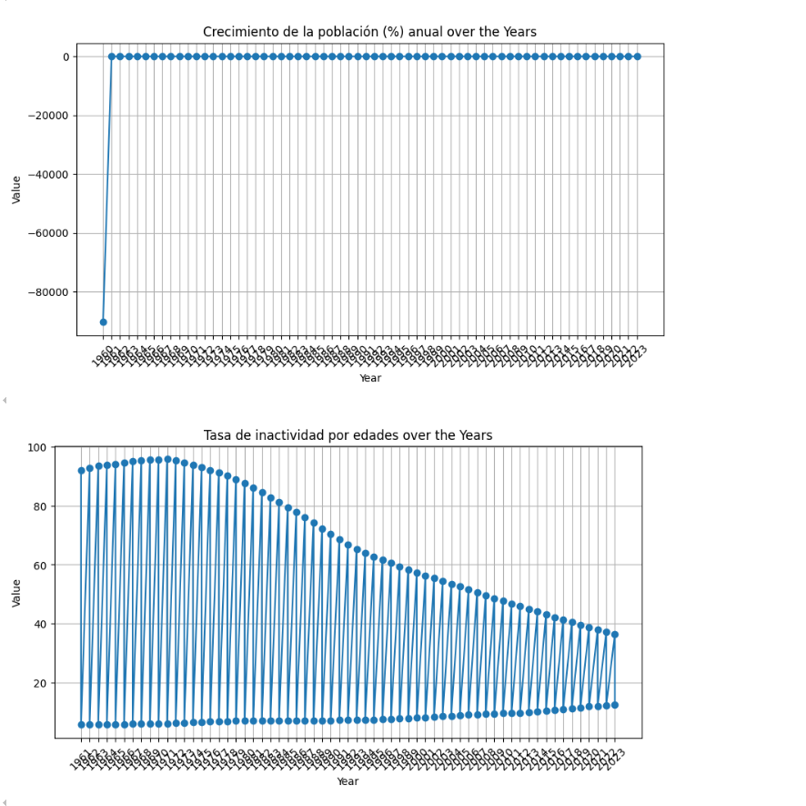
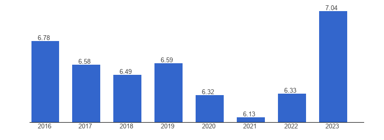
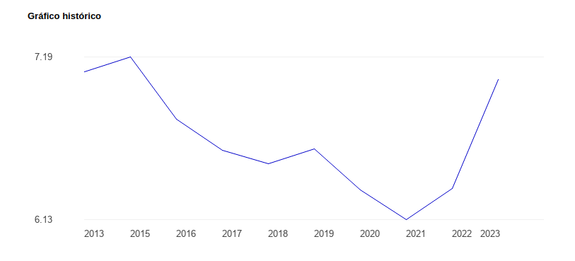

# 📋 Analisis predictivo sobre el estado de salud en Mexico y el mundo

### 🙆 Proyecto realizado por:
- Patricio A. Villanueva Gio
- Dafne Tamayo Leon
- Maria Paula Perez Romo

### 👥 Contextualización de Fuentes Confiables y Relevantes
En este proyecto, los datos provienen de fuentes confiables como el Banco Mundial, reconocido por sus metodologías rigurosas y sus colaboraciones con gobiernos internacionales para garantizar la precisión de sus indicadores. Además, se utilizaron fuentes secundarias como INEGI y Datos.gob.mx, que proporcionan información estadística relevante sobre salud y economía en México.
- __Banco Mundial__: Fuente primaria de datos, abarcando indicadores de salud y macroeconomía a nivel mundial.
- __INEGI__: Proporciona datos demográficos y económicos específicos de México.
- __Datos.gob.mx__: Fuente adicional para datos relacionados con salud y bienestar en México.

### 🔎 Contextualización Relevante al Análisis
La contextualización de este análisis está alineada con los objetivos del estudio: predecir el estado de salud de sectores vulnerables. Los indicadores seleccionados del Banco Mundial, como la prevalencia de diabetes, obesidad, y los recursos médicos disponibles, reflejan aspectos críticos que influyen directamente en la vulnerabilidad de diferentes sectores de la población. Esta contextualización es clave para realizar un análisis de la equidad y desigualdad en salud, ajustado al contexto de México y comparado con el panorama mundial.

### 📊 Análisis Exploratorio de Datos
El análisis exploratorio se basa en los indicadores seleccionados del Banco Mundial y proporciona gráficos y resúmenes estadísticos para comprender las tendencias de los factores de salud clave a lo largo del tiempo. A continuación se presentan algunas visualizaciones que representan el comportamiento de los indicadores:

- 'Necesidades de anticoncepción insatisfechas (% de mujeres casadas entre 15 y 49 años de edad)',
- 'Exhaustividad del registro de muertes con información sobre causa de muerte (%)',
- 'Exhaustividad de registro de nacimientos (%)',
- 'Exhaustividad de registro de nacimientos',
- 'Completeness of birth registration',
- 'Población',
- 'Crecimiento de la población (%) anual',
- 'Tasa de inactividad por edades',
- 'Mujeres que creen que está justificado que un marido golpee a su esposa cuando descuida a los hijos (%)',
- 'Mujeres que creen que está justificado que un marido golpee a su esposa cuando sale sin avisarle (%)',
- 'Mujeres que creen que está justificado que un marido golpee a su esposa cuando a ella se le quema la comida (%)',
- 'Mujeres que creen que está justificado que un marido golpee a su esposa cuando ella discute con él (%)',
- 'Proporción de mujeres víctimas de violencia física o sexual en los últimos 12\xa0meses (% de mujeres de entre 15 y 49\xa0años)'

__Visualización de Indicadores__






__Visualización de nuestra variable a predecir `HAPPINESS`__





### 💡 Relevancia del Análisis Exploratorio
El análisis exploratorio es crucial para comprender los factores que influyen en la vulnerabilidad de ciertos sectores de la población, especialmente en temas relacionados con la salud y el bienestar. A través de los gráficos de tendencias, podemos observar cómo variables como el gasto en salud, la prevalencia de enfermedades crónicas como la diabetes y la disponibilidad de recursos médicos afectan directamente la vulnerabilidad de la población. Sin embargo, para hacer un análisis más integral de fairness, es fundamental ampliar el conjunto de indicadores evaluados para incluir aspectos relacionados con la salud reproductiva, la violencia de género, y la exhaustividad de los registros de nacimientos y muertes, lo cual añade una capa más profunda al análisis de equidad y desigualdad en la distribución de recursos y oportunidades.

__Indicadores adicionales que proporcionan información relevante para el análisis de fairness:__

- __Necesidades de anticoncepción insatisfechas (% de mujeres casadas entre 15 y 49 años de edad)__: Este indicador muestra cómo el acceso limitado a servicios de salud reproductiva puede afectar la autonomía y el bienestar de las mujeres, lo cual es un aspecto clave para evaluar la equidad en el acceso a servicios sanitarios. Las mujeres que no tienen acceso a anticonceptivos están en mayor riesgo de embarazos no deseados, lo que puede aumentar la vulnerabilidad en términos de salud y bienestar económico.

- __Exhaustividad del registro de muertes con información sobre causa de muerte (%)__: La calidad de los registros de muertes es un indicador fundamental para evaluar la eficiencia de los sistemas de salud. Un registro incompleto podría subestimar la magnitud de ciertos problemas de salud, especialmente en grupos vulnerables, afectando la planificación de políticas públicas de salud. Las zonas con bajos registros pueden estar recibiendo menos recursos y atención de la que realmente necesitan.

- __Exhaustividad del registro de nacimientos (%)__: Al igual que los registros de muertes, un sistema de registro de nacimientos completo es esencial para garantizar el acceso equitativo a servicios de salud y protección social. La falta de registros precisos puede excluir a ciertos grupos, especialmente en zonas rurales o marginadas, de recibir servicios de salud y educación adecuados.

- __Crecimiento de la población (%) anual__: Este indicador es esencial para comprender las presiones sobre los sistemas de salud en crecimiento. Un rápido aumento de la población sin una expansión correspondiente de los servicios de salud puede llevar a la saturación del sistema y una menor calidad de atención para sectores vulnerables.

- __Tasa de inactividad por edades__: Este indicador refleja la proporción de personas fuera del mercado laboral en ciertos grupos de edad. Las personas que no participan en la economía formal, como las amas de casa o personas jubiladas, a menudo tienen menos acceso a servicios de salud y pueden ser más vulnerables a problemas de salud sin cobertura médica adecuada.

__Indicadores de violencia de género y justificaciones para la violencia doméstica:__

- __"Mujeres que creen que está justificado que un marido golpee a su esposa cuando descuida a los hijos"__, "cuando sale sin avisarle", "cuando se le quema la comida", y "cuando discute con él" (% de mujeres entre 15 y 49 años): Estos indicadores reflejan creencias profundamente arraigadas que normalizan la violencia de género. Estas percepciones son cruciales para el análisis de fairness, ya que una alta prevalencia de estas creencias puede señalar la necesidad de políticas de protección más robustas y servicios de apoyo psicológico y social en ciertas regiones. Además, estas creencias tienden a estar correlacionadas con niveles de pobreza y educación, lo que resalta aún más las disparidades en el acceso a servicios de protección y bienestar.

- __Proporción de mujeres víctimas de violencia física o sexual en los últimos 12 meses (% de mujeres de entre 15 y 49 años)__: La prevalencia de la violencia de género es un indicador clave de desigualdad y vulnerabilidad. Las mujeres que han sufrido violencia física o sexual tienen un mayor riesgo de sufrir problemas de salud física y mental, lo que refuerza la importancia de analizar este indicador en el contexto de la equidad en la distribución de recursos sanitarios y apoyo social.


En conjunto, estos indicadores permiten un análisis más integral de los factores que afectan la salud y el bienestar, destacando las disparidades no solo en términos de recursos económicos y médicos, sino también en aspectos relacionados con la equidad de género, el acceso a servicios básicos de salud reproductiva, y la protección social. El análisis de fairness se beneficia al incorporar estos aspectos, ya que proporciona una visión más completa de cómo las desigualdades estructurales y culturales influyen en los resultados de salud.

### ⚖️ Identificación de Desbalanceo de Clases en Grupos Protegidos

Uno de los objetivos clave de este análisis es identificar el desbalanceo de clases dentro de los grupos protegidos (como sectores de bajos ingresos o con acceso limitado a servicios de salud). Los indicadores relacionados con la prevalencia de enfermedades crónicas y la disponibilidad de recursos médicos en estos grupos destacan importantes desbalances que podrían afectar los resultados de los modelos predictivos.

- __Conteo de Grupos Protegidos vs. No Protegidos__: El análisis muestra cómo los sectores más vulnerables tienen menos acceso a médicos y camas hospitalarias, lo cual puede influir en su riesgo de desarrollar enfermedades y reducir el porcentaje de felicidad.

- __Correlaciones__: Se identifican correlaciones entre atributos sensibles (como el ingreso económico y la localización geográfica) y las variables objetivo, como la prevalencia de diabetes y obesidad.

### 🧮 Identificación de Desbalanceo General en el Dataset
Además del desbalance en los grupos protegidos, se identificaron desbalances generales en las clases del dataset. Por ejemplo, existe una sobre-representación de países de altos ingresos en comparación con países en desarrollo, lo cual podría afectar la capacidad de generalización de los modelos. `Esto lo resolvimos quedandonos unicamente con los datos de México`

### 🚩 Identificación de Potenciales Problemas con los Datos

Se detectaron varios problemas con los datos que podrían afectar la equidad del análisis, entre ellos:

-    Valores faltantes en ciertos años y países, que pueden distorsionar el análisis de tendencias a largo plazo.
-    Posibles sesgos en la recolección de datos, dado que algunos indicadores solo incluyen a personas con acceso a servicios de salud formales.
-    Composición Poblacional Distinta: Los datos no siempre reflejan la realidad de la población general, como en el caso de ciertos sectores económicos en México, lo que podría generar discrepancias al compararlos con otros países o con el mismo DatSet de `Happiness`

### 📚 Referencias en Formato APA 
- Banco Mundial. (2023). Indicadores de salud global. Recuperado de https://databank.bancomundial.org/source/health
- INEGI. (2023). Indicadores económicos y demográficos. Recuperado de https://www.inegi.org.mx/datos
- EAP_Obesidad20.pdf: INEGI. (2020, noviembre 11). Estadísticas a propósito del Día Mundial Contra la Obesidad (12 de noviembre). Instituto Nacional de Estadística y Geografía (INEGI). https://www.inegi.org.mx

- Bol-Cierre_2020.pdf: Secretaría de Salud. (2020). Sistema de Vigilancia Epidemiológica Hospitalaria de Diabetes Mellitus Tipo 2: Boletín de Cierre Anual 2020. Dirección General de Epidemiología. https://www.gob.mx/salud

- articulos.pdf: Basto-Abreu, A., López-Olmedo, N., Rojas-Martínez, R., Aguilar-Salinas, C. A., Moreno-Banda, G. L., Carnalla, M., Rivera-Dommarco, J. A., Romero-Martínez, M., Barquera, S., & Barrientos-Gutiérrez, T. (2023). Prevalencia de prediabetes y diabetes en México. Salud Pública de México, 65(supl 1), S163-S168. https://doi.org/10.21149/14832

- ESEP2022.pdf: INEGI. (2023, julio 31). Estadísticas de Salud en Establecimientos Particulares (ESEP) 2022. Instituto Nacional de Estadística y Geografía (INEGI). https://www.inegi.org.mx

- Diabetes.pdf: INEGI. (2021, noviembre 12). Estadísticas a propósito del Día Mundial de la Diabetes (14 de noviembre). Instituto Nacional de Estadística y Geografía (INEGI). https://www.inegi.org.mx

- EAP_Medico2021.pdf: INEGI. (2021, octubre 22). Estadísticas a propósito de las personas ocupadas como médicos (23 de octubre). Instituto Nacional de Estadística y Geografía (INEGI). https://www.inegi.org.mx

- GATS2023.pdf: Instituto Nacional de Salud Pública. (2023). Encuesta Global de Tabaquismo en Adultos (GATS) 2023. Instituto Nacional de Salud Pública (INSP). https://www.insp.mx

- ENADID2023.pdf: INEGI. (2024, mayo 22). Encuesta Nacional de la Dinámica Demográfica (ENADID) 2023. Instituto Nacional de Estadística y Geografía (INEGI). https://www.inegi.org.mx

---
# Desarrollo del proyecto


### ✒️ Metodologia
El proyecto consta de la siguiente estructura
``` bash
|--Salud del mundo
|
|----data
|   |--BancoMundial.csv # Informacion del banco mundial respecto a los indicadores de salud
|   |--Metadata_Country_API_8_DS2_es_csv_v2_32576.csv # Informacion extraida del banco mundial sobre los macro sectores economicos de mexico 
|   |--Metadata_Indicator_API_8_DS2_es_csv_v2_32576.csv # Lista de indicadores de salud
|
|----graphs
|   |--indicadores.png # Imagen con los indicadores graficados
|   |--indicadores_economia.png # Indicadores respecto al estatus economico
|
|----resources
|   |-- articulos.pdf          # Archivo sobre información general de salud
|   |-- Bol-Cierre_2020.pdf     # Archivo sobre cierre de operaciones del año 2020
|   |-- Diabetes.pdf            # Archivo sobre prevención y control de la diabetes
|   |-- EAP_Medico2021.pdf      # Archivo sobre encuesta de atención primaria en 2021
|   |-- EAP_Obesidad2020.pdf    # Archivo sobre la obesidad en 2020
|   |-- ENADID2023.pdf          # Archivo sobre la Encuesta Nacional de Dinámica Demográfica 2023
|   |-- ESEP2022.pdf            # Archivo sobre la Encuesta de Salud y Empleo en 2022
|   |-- GATS2023.pdf            # Archivo sobre la Global Adult Tobacco Survey 2023
|
|----templates
|   |--index.html # Home page
|   |--sugestions.html # FAQ
|   |--riskgroups.html # Grupos de riesgo de salud
|   |--graphs_predictions.html # Predicciones (Home page -> graphs_predictions)
|   |--error.html # Pagina para capturar errores
|
|----app.py # Servidor de python
|
|----README.md # README / Presentación del proyecto
```

### 🌍 Impacto
El impacto de este proyecto radica en su capacidad para identificar sectores vulnerables en términos de salud, lo cual es crucial para la formulación de políticas públicas y programas de intervención social. Al predecir qué grupos de la población son más propensos a estar en riesgo, se pueden tomar acciones preventivas que mejoren la calidad de vida y reduzcan las desigualdades en el acceso a la atención sanitaria. Además, el desarrollo de una página web de noticias vinculada a indicadores de salud ayudará a mantener informada a la población sobre cómo los eventos globales pueden influir en su bienestar.

### ⚖️ Importancia
Con el aumento de las disparidades en salud y el impacto de los determinantes sociales y económicos en el bienestar, es esencial contar con herramientas predictivas que permitan detectar y priorizar acciones hacia los sectores más necesitados. Este proyecto pretende ser una herramienta tanto para el público como para los gobiernos y organizaciones que buscan información relevante para tomar decisiones informadas. La importancia de este trabajo también radica en el hecho de que relaciona la información económica y social con el estado de salud, permitiendo un análisis integral y sistémico de la situación.

### 📊 Fuente de datos: Banco Mundial
Los datos utilizados en este proyecto provienen del Banco Mundial, una institución internacional que proporciona datos confiables y de alta calidad sobre distintos aspectos de desarrollo, incluyendo indicadores de salud y economía. El Banco Mundial es reconocido mundialmente por sus metodologías de recopilación de datos rigurosas y por la transparencia en la presentación de sus estadísticas. La fiabilidad de esta fuente se debe a que los datos son recopilados en colaboración con gobiernos nacionales, organizaciones internacionales y expertos del sector, asegurando tanto su precisión como su relevancia para el análisis de políticas y estrategias de desarrollo.

### 👥 Beneficiarios Potenciales y Aplicación Práctica
Los beneficiarios potenciales de este proyecto incluyen:

1. __Gobiernos y Entidades Públicas__: Los modelos predictivos pueden ayudar a los gobiernos a identificar los sectores más vulnerables y desarrollar políticas públicas que mejoren el acceso a servicios de salud y la calidad de vida de esas comunidades. Además, las predicciones sobre factores de riesgo permitirían a las instituciones de salud planificar sus recursos y estrategias de intervención con mayor precisión.

2. __Organizaciones no Gubernamentales (ONGs)__: ONGs dedicadas a la salud y el bienestar social podrían usar estos datos para enfocar mejor sus campañas y asignar recursos de forma más eficiente, asegurándose de llegar a aquellos sectores de la población con mayor necesidad.

3. __Profesionales de la Salud__: Los médicos, especialistas y otros profesionales de la salud podrían emplear las predicciones para identificar áreas y factores que influyen negativamente en la salud de la población, lo cual facilitaría la implementación de programas preventivos y de concienciación.

4. __Investigadores y Académicos__: Este análisis ofrece una base sólida para realizar investigaciones adicionales sobre la correlación entre variables económicas y el estado de salud. Además, la herramienta desarrollada puede ser usada como un punto de partida para estudios más complejos.

5. __Público en General__: La página web de noticias del proyecto informará al público sobre los factores económicos, sociales y ambientales que impactan su salud, ayudándolos a tomar decisiones más informadas para mejorar su bienestar personal.

### ⚠️ Retos y Limitaciones
__Calidad de los Datos__: Aunque el Banco Mundial es una fuente confiable, los datos siempre pueden tener limitaciones como errores de reporte, falta de cobertura en ciertas áreas o el desfase temporal en la actualización de los indicadores.

__Generalización del Modelo__: Los modelos predictivos pueden verse limitados en su capacidad para generalizar los resultados a otros países o regiones que no cuentan con datos similares o cuyos determinantes de salud sean diferentes.

__Factores Externos No Controlables__: Hay factores imprevistos, como pandemias, desastres naturales, o cambios políticos, que afectan la salud de la población y que no pueden ser fácilmente predichos o considerados por los modelos.

---

---

__🎯 Objetivos de la Investigación__

El primer paso para llevar a cabo una investigación efectiva fue definir objetivos claros y específicos. El objetivo principal de este estudio es __predecir los riesgos de salud de personas en situación de vulnerabilidad__. Para lograrlo, se ha enfocado el análisis en una serie de indicadores de salud que permiten evaluar el estado general de la población y los factores que influyen en su bienestar.

Los indicadores de salud seleccionados para esta investigación son:

- __Crecimiento de la población (%) anual__: Refleja el aumento o disminución de la población, un factor clave para entender las necesidades y demandas de servicios de salud.

- __Tasa de natalidad__: Ayuda a comprender la dinámica demográfica y sus implicaciones en la planificación sanitaria.
Gasto nacional en salud del gobierno general per cápita: Representa el compromiso del gobierno con el financiamiento de la salud, lo cual es esencial para asegurar el acceso equitativo.

- __Prevalencia de obesidad__: Un indicador importante para evaluar los riesgos relacionados con enfermedades crónicas.
- __Prevalencia de la diabetes (% de la población de 20 a 79 años)__: Proporciona información sobre uno de los problemas de salud más comunes y costosos en términos de tratamiento.
- __Prevalencia del consumo de tabaco (% de adultos)__: Es un factor determinante en el riesgo de múltiples enfermedades crónicas, incluidas las enfermedades cardiovasculares y respiratorias.
- __Médicos (por cada 1.000 personas)__: Evalúa la disponibilidad de profesionales de la salud, un factor clave en la calidad de la atención médica.
- __Comunidad de trabajadores de la salud (por cada 1.000 personas)__: Indica la cantidad de personal de apoyo y asistencia médica disponible.
- __Camas hospitalarias (por cada 1.000 personas)__: Representa la capacidad del sistema de salud para atender a los pacientes que requieren hospitalización.


Estos indicadores permiten no solo identificar los sectores en mayor riesgo, sino también entender cómo los recursos y las políticas de salud pueden influir en la reducción de vulnerabilidades. El análisis de estos factores contribuirá a una visión integral del estado de salud de la población vulnerable, facilitando la formulación de intervenciones efectivas.

__👣 Primeros pasos__

Una vez definido y acotado el objetivo en límites alcanzables, procedimos a la __recopilación de datos de fuentes confiables__. Este paso resultó ser `todo un desafío`, ya que descubrimos que la mayoría de las bases de datos de salud disponibles estaban más orientadas hacia la __política y la inversión monetaria en los sectores de salud__, en lugar de proporcionar datos específicos sobre el estado de salud de la población vulnerable.

Inicialmente, buscamos en diversas fuentes, incluyendo:

- Datos.gob.mx: Esta plataforma ofrece datos abiertos del gobierno de México. Revisamos conjuntos de datos relacionados con salud y bienestar, pero la mayoría de la información estaba más centrada en infraestructura y recursos financieros, y no tanto en indicadores específicos de salud de la población.

- Datos Libres: Exploramos diversas fuentes de datos libres disponibles en línea, tratando de encontrar información completa y relevante sobre la situación de salud tanto en México como a nivel global. Sin embargo, la información, aunque útil en algunos casos, era limitada o fragmentada.

- INEGI: El Instituto Nacional de Estadística y Geografía de México proporciona una gran cantidad de datos útiles sobre demografía y economía. Aunque encontramos indicadores valiosos, la información específica sobre algunos factores de salud y el nivel de detalle requerido para el análisis predictivo no estaban disponibles.

Después de explorar estas opciones, decidimos trabajar con los datos del Banco Mundial, que resultaron ser la mejor alternativa disponible. Esta fuente no solo proporcionaba una gran variedad de indicadores de salud, sino que también lo hacía de manera consistente y estandarizada a nivel mundial, lo cual nos permitía hacer comparaciones internacionales y entender el contexto de México dentro del panorama global.

El __Banco Mundial__ se destacó como la mejor opción por su __calidad y confiabilidad__. Los datos fueron recopilados en colaboración con gobiernos y organismos internacionales, asegurando su precisión y fiabilidad. Además, el nivel de detalle de los indicadores, que incluían desde la prevalencia de enfermedades hasta recursos disponibles como personal médico y camas hospitalarias, nos permitió realizar un análisis profundo y adecuado para nuestros objetivos.

__Tratamiento de los datos__

El proceso de tratamiento de los datos fue fundamental para asegurar la calidad del análisis. Al comenzar, nos encontramos con que los datos estaban muy sucios y requerían una limpieza significativa para poder ser útiles. Este proceso nos llevó un buen tiempo, pero fue esencial para alcanzar los objetivos planteados. A continuación, detallamos los pasos que seguimos para tratar los datos de manera efectiva:

__1. Creación de DataFrames México y Mundo__

El primer paso fue dividir la información disponible en dos grandes DataFrames: `mexicoDF`, que contiene solo los datos de México, y `mundoDF`, que contiene los datos del resto del mundo. Esta separación nos permitió realizar un análisis más específico y detallado, centrando nuestras visualizaciones y modelos predictivos en la comparación entre estos dos conjuntos de datos.

__2. Limpieza de Datos__

Durante la limpieza, observamos que había una gran cantidad de valores faltantes en las columnas correspondientes a diferentes años. Para manejar estos valores faltantes, aplicamos diferentes técnicas dependiendo del tipo de dato:
- Para las columnas numéricas, utilizamos la media para llenar los valores faltantes.
- Para las columnas categóricas, llenamos los valores faltantes con la moda.

__3. Selección de Indicadores y Preparación para el Análisis__

Con `mexicoDF`, procedimos a seleccionar únicamente las columnas necesarias para el análisis. Esto incluía los __nombres de los indicadores__ y las __columnas correspondientes a los años de 1960 a 2023__. Esta selección nos permitió concentrarnos en el análisis temporal de cada indicador.

Convertimos el DataFrame a un formato largo ("long format"), lo cual facilita la creación de visualizaciones y el análisis a lo largo del tiempo.
